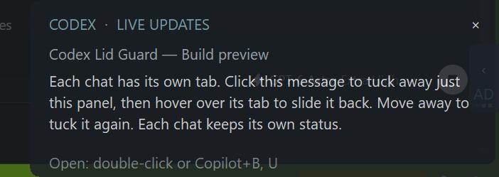
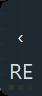
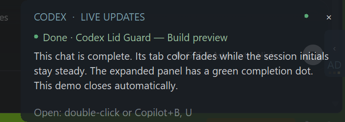

# Codex Lid Guard

Keep local Codex tasks running with your Windows laptop lid closed, and follow your chats from small desktop overlays while you work in other apps. When the last task finishes, Lid Guard restores your power settings and can put the laptop to sleep.

**Windows 10/11 x64 · VS Code · Official OpenAI Codex extension**

[Quick start](#quick-start) · [Overlays](#message-overlays) · [Shortcuts](#keyboard-shortcuts) · [Session menu](#status-bar-and-session-menu) · [Commands](#command-palette) · [Settings](#settings) · [Troubleshooting](#troubleshooting)

## Features

| Feature | What you get |
| --- | --- |
| Work with the lid closed | Automatic protection for local turns, including long tasks and automatic continuations. |
| Multiple sessions | Protection stays active until the final running turn stops, across chats and VS Code windows. |
| Restore normal sleep | Your previous battery and plugged-in lid actions are saved and restored exactly. |
| Desktop message previews | Up to three independent, translucent overlays on the originating editor's display. |
| Quick chat switching | Hover to peek, cycle with Copilot shortcuts, or double-click to open the exact chat in a maximized VS Code window. |
| Per-chat progress | Moving amber dots for busy tabs; a repeating yellow background fade for completed tabs. |
| Session menu | A status-bar shield opens running and recent chats, with unread completions highlighted. |
| Sound alerts | Completion sounds and optional alerts for approvals or questions, quiet while you view the relevant chat. |

## Quick start

1. Install and enable the official OpenAI Codex extension in VS Code.
2. Install the shared `codex-lid-guard.vsix` using **Extensions: Install from VSIX...**, or run this from the repository root:

   ```powershell
   code --install-extension .\extension\codex-lid-guard.vsix
   ```

3. Start a local Codex task. Lid Guard enables itself automatically; the status bar shows **Codex awake · 1** while protecting one turn.
4. To see desktop previews, open the Command Palette with **Ctrl + Shift + P** and run **Codex Lid Guard: Toggle Message Overlay**. Overlays are off by default.
5. Switch to another app or chat, or minimize VS Code. The background chat appears as an edge tab when an update is available.

Try **Codex Lid Guard: Preview Message Overlay** for a 35-second demonstration with three sample chats. They finish independently after 15, 18, and 21 seconds. The demo closes automatically and does not open real chats.

The VSIX includes a self-contained native helper. Recipients do not need Node.js, Rust, .NET, administrator access, or lifecycle-hook setup for core lid protection.

## Message overlays

### Follow up to three chats

Each of the three most recently active eligible chats gets its own tab and latest assistant update. Titles use **project folder — chat title**, refresh after renaming, and show **Untitled chat** until a title is available. Tabs use short, distinct letter codes for keyboard access.

A tab appears when its chat is in the background: another app covers VS Code, the editor is minimized, another VS Code window is focused, or a different chat is selected. It hides when that exact chat is visible in its focused VS Code window. Returning to one chat leaves the other chats' tabs available.

When VS Code loses focus or minimizes, the message shrinks into its edge tab. New messages update the tucked preview without expanding it. Each chat keeps its own state, with separate lanes so panels do not overlap or shift one another. A fourth eligible chat replaces the least recently active visible chat.



*Expanded sample chat. The translucent panel stays above other windows without taking keyboard focus when updates arrive.*

### Mouse controls

| Action | Result |
| --- | --- |
| Hover over a tab | Slide out that chat's preview. |
| Move away from a hover-opened preview | Fold it back after a short delay. Moving between the tab and panel keeps it open. |
| Click a tab | Expand the preview and leave it open after the pointer leaves. |
| Single-click the message | Fold the panel into its edge tab. |
| Double-click the message | Maximize the originating VS Code window and open that exact chat, including chats sharing the same project window. |
| Click **×** in the expanded header | Close that chat's panel and tab until its next turn. This does not stop the task or mark the chat as viewed. |

Opening a chat reuses its existing editor tab and group. The overlay hides after confirming the selected chat is active; if opening fails, the notification stays available. Switching away from a viewed chat brings back its minimized tab.

Right-side panels slide flush with the display edge. Minimize and restore transitions follow the editor's window events, and animations respect the Windows animation setting. Hover uses cached previews so reading messages does not wait for session-file access.

### Busy and completed tasks

| State | What you see |
| --- | --- |
| Working | Moving amber dots on that chat's minimized tab. |
| Completed, tab folded | The whole tab background fades between charcoal and yellow (`#FFD000`). Initials stay steady; there is no completion tick. |
| Completed, preview expanded | Small pulsing green dots in the header and beside the completed message title. |
| Animations disabled in Windows | Steady status colors instead of pulsing or moving indicators. |

| Completion fade: dim phase | Completion fade: bright phase |
| :---: | :---: |
|  |  |

*Two screenshots from the same repeating 1.8-second completion animation.*



Completion indicators stay on until you open that chat or view it manually in its focused VS Code window. Hovering, expanding a preview, or opening a different chat does not clear them. A new turn clears the previous completion. Cancellation is not shown as successful completion.

Unread completions remain available until viewed, subject to the three-tab limit. Closing a notification hides it until the next turn without acknowledging its completion. The latest previews for the three most recent chats stay cached; older previews use the configured retention time, paused while tucked away.

Long messages are shortened in the overlay. Open the chat for the full reply. Updates appear after Codex writes them locally, rather than token by token. Chats without an identified editor window do not get overlays.

## Keyboard shortcuts

These overlay shortcuts work while tabs are visible, even when you are using another app. **Copilot** means the physical Copilot key sending its standard **Win + Shift + F23** sequence.

| Shortcut | Action |
| --- | --- |
| Hold **Copilot**, tap **Tab** | Expand the next visible chat and fold the previous preview. Tap again to continue; cycling wraps after the last tab. |
| Repeat **Copilot + Tab** | Continue cycling from the previously selected chat. |
| **Enter**, after selecting a tab with the shortcut | Open that chat and maximize its VS Code window. |
| **Copilot + first tab letter** | Expand that specific chat. For `DR`, press **Copilot + D**. |
| Add the **second tab letter** | Open the selected chat. For `DR`, press **R** after **Copilot + D**. **Enter** also works. |
| **Esc**, immediately after keyboard selection | Close the selected overlay and its tab until the next turn. |
| **Esc**, before selecting a tab | Cancel the shortcut. |

For example, hold **Copilot**, tap **Tab** until the desired message appears, then press **Enter**. Or use **Copilot + D**, then **R**, for a tab labeled `DR`. Typing **D + R** by themselves does not open a chat.

Some keyboards emit the Copilot sequence as a quick tap even while the physical key is held. On those keyboards, enter each next step within **1.5 seconds**. The shortcut expires when that interval passes or focus changes; Enter, Esc, and Tab then keep their normal behavior in the current app. With no visible tabs, Copilot keeps its normal behavior.

Keyboard-opened previews stay expanded like click-opened previews. Codes remain stable while a tab is visible, and the expanded footer shows that tab's letter shortcut. These global overlay shortcuts are handled by the native helper, not VS Code's Keyboard Shortcuts editor.

## Status bar and session menu

| Status-bar label | Meaning |
| --- | --- |
| **Codex Lid Guard** with a shield | Enabled and ready; no active protection needed. |
| **Codex awake · N** | Keeping Windows awake for `N` active turns. |
| **Codex sleep pending** | The last turn stopped with the lid closed; the sleep grace period is running. |
| **Codex Lid Guard** with a disabled icon | Disabled. Click to enable. |
| Warning or error icon | Hover for the diagnostic message. |

Click the shield, or run **Codex Lid Guard: Show Status**, to open the session menu. It lists all awake sessions and fills the list to five entries with recently active chats. The awake count includes only running turns.

The menu labels chats by folder and title, highlights the currently viewed chat, distinguishes running sessions, and keeps completed sessions blue until viewed. Select an entry to open its chat. The popup follows VS Code's theme and display scaling; high-contrast themes use an opaque background.

| Key while the session menu is open | Action |
| --- | --- |
| **Up / Down** | Select the previous / next session. |
| **Tab / Shift + Tab** | Select the next / previous session. |
| **Enter / Space** | Open the selected session. |
| **Esc** | Close the menu. |

## Lid protection and alerts

When a local turn starts, the guardian saves the active Windows power scheme's plugged-in and battery lid actions, temporarily sets both to **Do nothing**, and keeps the system awake. It follows lifecycle records through completion or cancellation, including automatic continuations. Multiple turns are counted together, so one finishing does not interrupt the others.

After the final turn stops, the saved lid actions are restored. If the lid is still closed and automatic sleep is enabled, Windows sleeps after the configured grace period: **10 seconds** by default. Opening the lid or starting another turn cancels pending sleep. With no local turn running, closing the lid follows normal Windows behavior. The display can turn off while the system continues working.

The bundled Herdr **done** sound plays when a task stops. Optional hooks add immediate **request** sounds for permission approvals and structured questions. Automatic alerts are quiet by default while the relevant chat is visible in its focused VS Code window; other chats and background windows can still alert.

To enable request alerts, run **Codex Lid Guard: Enable Optional Hook Alerts** and follow the one-time Codex hook review. Core protection already works without this review. **Test Alert Sounds** plays both samples regardless of focus, provided sounds are enabled.

## Command Palette

Open with **Ctrl + Shift + P**, then search for **Codex Lid Guard**.

| Command | Purpose |
| --- | --- |
| **Codex Lid Guard: Enable** | Enable automatic protection for local turns. |
| **Codex Lid Guard: Disable and Restore Power Settings** | Disable monitoring, restore saved power settings, and remove optional Lid Guard hooks. |
| **Codex Lid Guard: Show Status** | Show guardian status or the running/recent session menu. |
| **Codex Lid Guard: Restore Power Settings Now** | Restore saved Windows power settings immediately. |
| **Codex Lid Guard: Toggle Message Overlay** | Turn desktop previews on or off. |
| **Codex Lid Guard: Preview Message Overlay** | Run the independent 35-second demo. |
| **Codex Lid Guard: Enable Optional Hook Alerts** | Set up immediate approval/question alerts and their one-time review. |
| **Codex Lid Guard: Test Alert Sounds** | Play the completion and request samples. |

## Settings

Open VS Code Settings and search for **Codex Lid Guard**. These are all available extension settings.

| Setting | Default | Description |
| --- | --- | --- |
| `codexLidGuard.enabled` | `true` | Automatically monitor and protect local Codex turns. |
| `codexLidGuard.messageOverlay` | `false` | Show desktop message previews for background chats. |
| `codexLidGuard.overlayOpacity` | `82` | Opacity percentage, from `30` to `100`. Lower is more transparent. |
| `codexLidGuard.overlayPosition` | `bottom-right` | Preview corner: `bottom-right`, `bottom-left`, `top-right`, or `top-left`, on the originating editor's display. |
| `codexLidGuard.overlayDurationSeconds` | `90` | Retention for older previews, from `10` to `600` seconds. The latest three chats and unread completions remain available. |
| `codexLidGuard.alertSounds` | `true` | Enable completion and request sounds. |
| `codexLidGuard.alertSoundsOnlyWhenUnfocused` | `true` | Keep automatic alerts quiet while viewing the relevant chat. |
| `codexLidGuard.optionalHooks` | `false` | Install optional request-alert hooks; requires a one-time Codex review. |
| `codexLidGuard.sleepWhenLidClosed` | `true` | Sleep after the final turn stops if the lid is still closed. |
| `codexLidGuard.sleepDelaySeconds` | `10` | Grace period before sleep, from `0` to `300` seconds. |

For example, enable overlays and give yourself 30 seconds before sleep in `settings.json`:

```json
{
  "codexLidGuard.messageOverlay": true,
  "codexLidGuard.overlayOpacity": 82,
  "codexLidGuard.sleepDelaySeconds": 30
}
```

## Privacy and recovery

Core monitoring uses Codex's local lifecycle metadata and appended lifecycle records. It queries thread IDs, rollout locations, and working directories for tracking, cleanup, and display; it does not query prompt or response fields from the metadata database.

Enabling message overlays additionally reads newly appended assistant display messages from local session files. User prompts, reasoning, and tool output are ignored for previews. Message text stays in memory and is excluded from guardian logs and status snapshots. Enabling starts with new messages; disabling clears the previews.

Before changing power settings, the guardian writes a recovery record to `%LOCALAPPDATA%\CodexLidGuard\power-recovery.json`. If interrupted, its next launch restores the saved settings first. Optional hook edits are backed up to `~/.codex/hooks.json.before-codex-lid-guard`.

**Before uninstalling, run Codex Lid Guard: Disable and Restore Power Settings.** This restores active power-policy changes and removes optional hook entries.

## Troubleshooting

| Symptom | Check |
| --- | --- |
| No overlay appears | Enable **Toggle Message Overlay**, then wait for a new assistant update and switch away from that chat. The focused chat intentionally hides its own tab. Use **Preview Message Overlay** to check rendering. |
| A tab disappeared | You may have viewed its chat, closed the notification, or brought a newer chat into the three-tab limit. A closed notification returns on that chat's next turn. |
| Copilot opens Windows Settings or another app | Overlay shortcuts require a visible tab and the standard **Win + Shift + F23** key sequence. A Windows or keyboard-utility remap that replaces that sequence will prevent detection. Without visible tabs, the key keeps its normal Windows action. |
| Enter or Esc does nothing to the preview | Select a tab using Copilot first, then press Enter or Esc within the active shortcut. On keyboards that emit a quick Copilot tap, the interval is 1.5 seconds. |
| Double-click opens the window but not the right chat | If upgrading from before `0.1.68`, reload existing VS Code windows once to load the exact-chat navigation handler. |
| No alert sound | Check `alertSounds`. The current focused chat is quiet by default. Approval/question alerts also need optional hooks and their review. |
| Windows stays awake after a task stops | Check the shield's active-turn count for another running chat. Use **Show Status** to inspect sessions or **Restore Power Settings Now** to restore the saved policy. |

This extension protects **local** tasks on Windows; Codex cloud tasks run elsewhere. Overlay parsing depends on local Codex file formats, which can change between Codex releases.

## Development

Build on Windows with Node.js 20+, Rust through `rustup`, and the Visual Studio C++ build tools. From the repository root:

```powershell
cd extension
npm.cmd ci
npm.cmd test
cd ..
cargo test --manifest-path .\native\CodexLidGuard\Cargo.toml --locked
cargo clippy --manifest-path .\native\CodexLidGuard\Cargo.toml --all-targets --locked -- -D warnings
cd extension
npm.cmd run package
```

Packaging compiles TypeScript, builds the native helper, and writes `extension/codex-lid-guard.vsix`. Native tests that display owned preview windows are ignored by default and run separately for interaction checks.

The helper supports `status`, `restore`, `overlay-preview`, `sound done`, and `sound request` for diagnostics. Logs are written to `%LOCALAPPDATA%\CodexLidGuard\guard.log` and rotate at 1 MB. The latest state is stored in `%LOCALAPPDATA%\CodexLidGuard\status.json`.

The screenshots above are captures of the native demo UI, with sample chat text. The two bundled alert files come from Herdr 0.8.2 under Apache-2.0; see the third-party notices and the license shipped beside the sounds.
