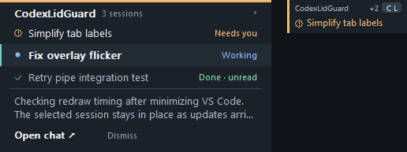
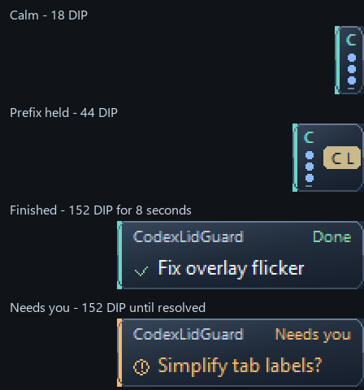

# Codex Lid Guard

**Close your laptop lid. Let Codex keep working.**

Codex Lid Guard keeps your Windows laptop awake while local Codex tasks run, then restores your normal power settings when they finish. Optional desktop previews let you check progress from other apps, and background tasks can keep running after you close VS Code.

**Windows 10/11 x64 | VS Code 1.90+ | Official OpenAI Codex extension**

[Get started](#quick-start) · [Desktop previews](#message-overlays) · [Background tasks](#background-tasks) · [Shortcuts](#keyboard-shortcuts) · [Settings](#settings) · [Help](#troubleshooting)



*A native preview with sample sessions. Select a task to read its update; choose Open chat to return to the conversation.*

## What you can do

- **Keep working with the lid closed.** Protection starts automatically and stays on until the last active task finishes, including tasks in other VS Code windows.
- **Follow several projects from other apps.** Small two-line tabs show the project, highest-priority task, status icon, and extra-session count. Follow three projects by default, or choose up to ten.
- **Run tasks independently of VS Code.** Start a background task in Lid Guard and return to its own conversation window whenever you need to.
- **Return to normal sleep automatically.** Your original lid settings are restored when work stops. If the lid is still closed, the laptop sleeps after a 10-second grace period by default.

## Quick start

### 1. Install

In VS Code, install and enable the **official OpenAI Codex extension**, then sign in and open a local project folder.

You'll also need **`codex-lid-guard.vsix`**, the Lid Guard installer. Use a copy shared with you, or [build it from source](#build-from-source).

1. Press **Ctrl + Shift + P** to open the Command Palette.
2. Run **Extensions: Install from VSIX...** and select the file.
3. Reload VS Code if prompted. When updating, reload any other open VS Code windows too.

The installer includes the helper that runs in the background. You do not need Node.js, Rust, .NET, administrator access, or optional hook setup to use lid protection.

### 2. Start a Codex task

Use Codex in VS Code as usual. Lid Guard enables itself automatically.

Look for **Codex awake · 1** in the status bar before closing the lid. The number tells you how many tasks Lid Guard is keeping awake. When the last task stops, your saved lid settings are restored. Opening the lid or starting another task cancels pending sleep.

To keep a task running **after VS Code closes**, use [Start Background Task](#background-tasks) to create a conversation managed by Lid Guard.

### 3. Turn on desktop previews (optional)

Run **Codex Lid Guard: Toggle Message Overlay** from the Command Palette. Previews are **off by default**.

Wait for a new assistant update, then switch to another app or chat. A named project tab appears at the screen edge. Hover or click to see its sessions, select a task, and choose **Open chat**.

To try the controls without starting a task, run **Codex Lid Guard: Preview Message Overlay**. It shows five sample sessions across two projects (subject to your tab limit) and closes automatically after 35 seconds.

## Message overlays

Tabs and drawers use dark glass with live background blur on Windows 11 22H2 and newer. Text and shortcut badges stay solid. **Overlay Opacity** controls only the glass background, with a new 35% default; 100% opacity hides the blur. Windows manages the blur and its transparency/accessibility fallbacks. Older Windows versions keep the translucent glass tint.



A calm project occupies an 18 by 42 DIP sliver: a folder monogram and priority-sorted session beads. Blue beads breathe while working, green halos mark unread results, hollow grey beads mean read or idle, and amber rings mean a question. Three beads plus a dash represent four or more sessions. Holding the shortcut prefix reveals the assigned two-letter code in a 44 DIP tab. A new result unfolds to 152 DIP and stays popped out until you preview, view, or dismiss it, or start new work in that chat. Opening the drawer by mouse hover, click, or keyboard shortcut consumes the existing completion pop-outs, so it folds back to the small tab. Unread markers remain, and a new result pops out again. A question stays 152 DIP wide with the question text until it is resolved. Click a popped-out tab, preview background, or session row to immediately expand in height to fit the latest reply at the same width; it stays open after the pointer leaves or the keyboard preview times out. Click its background or selected session again to minimize it. Clicking a different session switches chats and keeps the overlay open. Double-click a tab, preview, or session title to maximize the same overlay. Minimizing waits for the Windows double-click interval so a double-click can maximize without folding first. Hover or expand a tab to see a 344 DIP drawer with up to four compact task rows, a two-line update, and Open/Dismiss actions. Larger lists scroll; selecting a task keeps the rows in place. Neighboring tabs visibly slide aside first; expansion waits until they are clear. Tabs slide back only after the drawer has fully folded. Switching projects folds the previous drawer first. The expanded project stays above sibling tabs without taking keyboard focus. Same-named folders get distinct path labels, with their full path shown in the drawer header.

Keep a preview open for five seconds, whether opened by mouse or keyboard, and the same glass overlay smoothly grows in height at the screen edge to fit the latest reply, keeping its original width. Long replies use the available screen height and scroll. Hover over the preview and start typing, or click the message box, to focus the composer and enter this message-sized view immediately. The first characters go into your draft. The overlay centers and shows the full conversation after five seconds from your first keystroke, or sooner if your draft exceeds the available line width (including a new line). Sending, clearing the draft, switching sessions, or folding cancels the typing timer. Copilot shortcut chords and Ctrl/Alt/Windows shortcuts do not trigger hover typing. The project header, session list, message box, send icon, and Open chat/Dismiss controls keep their existing appearance. It shows the selected session's saved conversation with compact blue message bubbles on the right and Codex replies directly on the glass at the left. A small Codex label appears once per consecutive group of replies. Bold text, numbered and bulleted lists, inline code, and paragraph spacing make long answers easier to read. Image attachments appear as compact chips and notices use centered muted text. Three dots animate in the header while the project is working, in both the expanded drawer and centered chat; reduced-motion settings keep them steady. New messages appear as they arrive, including after Codex resumes the session in a new transcript file. Earlier conversation history is retained. Scroll up to read earlier messages; incoming replies preserve your reading position. **Enter** or the icon-only send button submits your message and clears the composer immediately. **Shift+Enter** adds a line. Failed sends restore the message alongside any new draft. **Escape** or the header arrow animates the overlay back into its edge tab without ending the session or losing your draft. Escape also works during expansion. These 300 ms transitions respect the Windows animation setting.

The session currently viewed in a focused editor hides from the preview; other sessions in its project remain available. The project tab hides when it has no visible sessions. It returns when you switch away.

| To… | Do this |
| --- | --- |
| Peek at a project | Hover over its tab. Move away to fold the preview back. |
| Keep a project open | Click its tab. |
| Select a session | Click its task title. The selected row is highlighted and its update appears below the list. |
| Fold a project | Click the chevron in the header. |
| Start a new chat | Click the **chat-plus icon** in the header of either the expanded drawer or maximized overlay. A blank session opens in the same overlay and project, with the message box focused. Existing drafts stay with their sessions. |
| Send a message | Select a session, type in the box at the bottom left, and press **Enter** or click the **up-arrow send icon**. The message goes to that conversation without bringing VS Code forward. |
| Read the latest reply | Leave the preview open for five seconds, start typing, or click its message box. |
| Read the full chat in the overlay | Keep composing for five seconds, or type beyond the message box line width. |
| Open a chat | Choose **Open chat** or use the keyboard open shortcut. Double-click a session title to maximize its conversation in the overlay. Editor chats open in VS Code; overlay-created chats expand in the same overlay. Choose **Open in VS Code** below an overlay-created conversation to open its saved history in the original project. |
| Dismiss one session until its next task | Choose **Dismiss** beneath the selected update. Other sessions stay available; the task is not stopped. |
| Browse a larger project | Scroll inside the session list with the mouse wheel, or drag/click its scrollbar. The preview stays fixed below it. |

New messages update the preview without taking keyboard focus. Long replies are shortened in the compact preview; click the message box to read the full history in the enlarged overlay.

New overlay chats run in Lid Guard using the installed Codex runtime and stay idle until you send a message. They use normal project write permissions and ask for approval when needed. **Open chat** expands the same overlay. Approval details appear in the conversation with **Allow once** and **Deny** buttons. Questions can be answered through the composer, one at a time. Use **Open in VS Code** to find the saved conversation in the project's Codex panel. The live background turn and any pending requests remain managed by Lid Guard. **Codex Lid Guard: Background Sessions** still provides the task-management window for stopping or ending a session.

The enlarged overlay shows the selected session. Switching sessions changes the full history and restores that session's draft. Replies use the chat's existing Codex process and settings, including follow-ups while it is working. Editor-owned questions and approvals still need to be answered in Codex; background-session requests can be answered directly in the overlay. If the chat is no longer loaded, choose **Open chat** once before replying.

### Know when a task is done

| Indicator | Meaning |
| --- | --- |
| **Working** | The task is running. |
| **Needs you** | A reported approval or question is waiting for your response. |
| **Done · unread** / **unread result** | The task finished and you have not viewed its chat yet. |
| **Done** | The task completed and its result has been viewed. |
| **Idle** | No active work or confirmed completion is reported for this session. |

Reading a preview does not mark the completion as viewed. Open the chat to clear its indicator, or start a new task in that chat. Tasks sort by needs-response, working, unread completion, then idle/read completion; selection stays on the same task. A filled dot means working, a ringed exclamation means needs-response, and a check means done. The project stripe turns amber while any session needs you and otherwise uses its project color. Needs-response indicators are immediate for background sessions; editor sessions use the optional request hooks.

Choose **1–10 project tabs** with **Overlay Max Tabs** in Settings. At the limit, a more recently active project can replace an older one. Recent tabs remain available after VS Code closes while the helper is running, so you can reopen the original project and session. Retaining a tab alone does not keep Windows awake or keep an editor task running.

## Background tasks

Use this mode when you want a task to continue after **all VS Code windows are closed**.

1. Open a **trusted local project folder** in VS Code, with Codex installed and signed in.
2. Run **Codex Lid Guard: Start Background Task** from the Command Palette.
3. Describe the task. Lid Guard opens a separate conversation window.
4. Choose **Minimize to tab**, or close that conversation window. The task continues, and you can close VS Code too.
5. To return, open its overlay, run **Codex Lid Guard: Background Sessions**, or choose **Background Codex sessions…** from the Windows tray shield menu. The tray menu works even with overlays off.

In the conversation window, you can read replies, answer questions, review approval requests, stop the current task, and send follow-ups. Tasks can edit the selected project; additional permissions require your approval through **Allow once** or **Deny**. Sleep protection stays active while a task works or waits for your response.

**Closing the conversation window keeps the session running. Choosing End session stops it.** You can keep up to ten background sessions open.

This starts a new conversation; it cannot take over a task already running inside VS Code. Lid Guard and Windows must remain running. Quitting the helper or restarting Windows interrupts background work, and Lid Guard does not automatically resume it. Codex keeps the conversation in its normal local history. Unsupported interactions, such as secret input or MCP elicitation, return an error without granting permission.

## Keyboard shortcuts

These shortcuts work from other apps while overlay tabs are visible. The defaults use the physical **Copilot** key; you can choose another key combination in Settings.

| Shortcut | Action |
| --- | --- |
| Hold **Copilot**, tap **Tab** | Preview the next project. Tap Tab again to keep cycling. |
| **Enter** after selecting a project | Open its selected session. |
| **Esc** immediately after selecting a project | Dismiss its selected session until its next task. Other sessions stay available. |
| **Tab** after releasing Copilot | Fold the keyboard-selected preview immediately. |
| **Copilot + first shortcut letter**, then the **second letter** | Preview the project, then open its selected session. Hold the prefix to reveal the assigned letters beside each sliver; questions and completion notices keep their full width. |

Previews selected with **Copilot + Tab** fold automatically three seconds after you release Copilot. Click-opened and letter-selected previews stay open.

**Without a Copilot key**, set **Overlay Shortcut Prefix** to something like `Ctrl+Alt+Space`. Press that combination, then Tab to choose a project and Enter to open its selected session. Configure these global shortcuts in extension Settings.

<details>
<summary>Shortcut timing and customization</summary>

- The default Copilot binding expects **Win + Shift + F23**. Keyboard utilities that remap that sequence can prevent detection.
- Some keyboards send Copilot as a quick tap even when you hold it. On those keyboards, enter each next step within **1.5 seconds**. Press Copilot again before Tab to keep cycling; Tab alone folds the selected preview.
- Enter and Esc return to their normal behavior when the shortcut expires or focus changes. Esc before selecting a tab cancels the shortcut.
- Customize **Overlay Cycle Key**, **Overlay Open Key**, and **Overlay Close Key** using different keys for each. Shortcut letters appear only while the prefix is held, then the sliver returns to its calm width.
- Changes apply immediately. Invalid or duplicate bindings disable shortcuts and show a settings warning.
- Turn off **Overlay Shortcuts Enabled** to disable global shortcuts. Without visible tabs, Copilot keeps its normal Windows behavior. These bindings are separate from VS Code's Keyboard Shortcuts editor.

</details>

## Status, sounds, and quitting

Click the shield in VS Code's status bar, or run **Codex Lid Guard: Show Status**, to see running and recent chats. Select a chat to open it. Completed chats stay highlighted until viewed.

| Status | Meaning |
| --- | --- |
| **Codex Lid Guard** with a shield | Ready; no tasks currently need protection. |
| **Codex awake · N** | Keeping Windows awake for `N` active tasks. |
| **Codex sleep pending** | The lid is closed and the sleep grace period is running. |
| **Lid Guard stopped**, or a disabled icon | Click to enable Lid Guard again. |
| A warning or error icon | Hover over it for details. |

Completion sounds are on by default and stay quiet while you view the relevant chat. Run **Codex Lid Guard: Test Alert Sounds** to hear the samples. For immediate approval and question alerts, run **Codex Lid Guard: Enable Optional Hook Alerts** and complete the one-time Codex hook review. Core lid protection works without this review.

To quit completely, click or right-click the shield in the **Windows notification area** and choose **Quit Lid Guard (close all tabs)**. This closes overlays, ends background workers, cancels pending sleep, and restores saved power settings. Run **Codex Lid Guard: Enable** to start it again.

## Settings

Open VS Code Settings with **Ctrl + ,** and search for **Codex Lid Guard**.

| If you want to… | Change this setting |
| --- | --- |
| See desktop chat previews | Turn on **Message Overlay**. Default: off. |
| Follow more projects | Set **Overlay Max Tabs** from 1 to 10. Default: 3. |
| Move the previews | Choose a corner with **Overlay Position**. Default: bottom-right. |
| Make previews more transparent | Lower **Overlay Opacity**. Default: 35%; labels remain solid. |
| Use a keyboard without a Copilot key | Change **Overlay Shortcut Prefix**, for example to `Ctrl+Alt+Space`. |
| Turn off sounds | Turn off **Alert Sounds**. Default: on. |
| Allow more time before sleep | Increase **Sleep Delay Seconds**. Default: 10 seconds. |
| Disable Lid Guard's automatic sleep after tasks | Turn off **Sleep When Lid Closed**. Your original Windows lid settings still get restored. |

<details>
<summary>All settings and defaults</summary>

All keys below start with `codexLidGuard.`. Use the full key when editing `settings.json`.

| Setting | Default | Options or behavior |
| --- | --- | --- |
| `enabled` | `true` | Monitor and protect local tasks automatically. |
| `messageOverlay` | `false` | Show assistant previews for background chats. |
| `overlayMaxTabs` | `3` | 1–10 project tabs. Each groups its sessions; one project expands at a time. |
| `overlayOpacity` | `82` | 30–100 percent. |
| `overlayPosition` | `bottom-right` | `bottom-right`, `bottom-left`, `top-right`, or `top-left`. |
| `overlayDurationSeconds` | `90` | 10–600 seconds for older previews. Recent chats and unread completions remain available, subject to the tab limit. |
| `overlayShortcutsEnabled` | `true` | Enable global overlay shortcuts. |
| `overlayShortcutPrefix` | `Copilot` | `Copilot`, or a combination with Ctrl, Alt, or Win plus one key. |
| `overlayCycleKey` | `Tab` | Select the next tab after the prefix. |
| `overlayOpenKey` | `Enter` | Open the selected chat. Its second tab letter also works. |
| `overlayCloseKey` | `Escape` | Dismiss the selected session or cancel the shortcut. |
| `alertSounds` | `true` | Play completion and request sounds. |
| `alertSoundsOnlyWhenUnfocused` | `true` | Keep automatic alerts quiet while viewing the relevant chat. |
| `optionalHooks` | `false` | Enable request-alert hooks after a one-time Codex review. |
| `sleepWhenLidClosed` | `true` | Sleep after the last task stops if the lid is still closed. |
| `sleepDelaySeconds` | `10` | 0–300 seconds before sleep. Opening the lid or starting another task cancels it. |

For example, add these to your VS Code `settings.json` to enable previews and allow 30 seconds before sleep:

```json
{
  "codexLidGuard.messageOverlay": true,
  "codexLidGuard.sleepDelaySeconds": 30
}
```

</details>

<details>
<summary>All Command Palette commands</summary>

Press **Ctrl + Shift + P** and search for **Codex Lid Guard**. Every command below has the prefix **Codex Lid Guard:**.

| Command | What it does |
| --- | --- |
| **Enable** | Start automatic protection. |
| **Disable and Restore Power Settings** | Disable monitoring, restore saved settings, and remove optional Lid Guard hooks. |
| **Show Status** | Show status or the running and recent session menu. |
| **Start Background Task** | Start a conversation that can continue after VS Code closes. |
| **Background Sessions** | Open a background conversation window. |
| **Restore Power Settings Now** | Restore saved Windows power settings immediately. |
| **Toggle Message Overlay** | Turn desktop previews on or off. |
| **Preview Message Overlay** | Try the 35-second sample chat demo. |
| **Enable Optional Hook Alerts** | Set up immediate approval and question alerts. |
| **Test Alert Sounds** | Play both alert samples when sounds are enabled. |

</details>

## Troubleshooting

| Problem | What to try |
| --- | --- |
| **No desktop tab appears** | Turn on **Toggle Message Overlay**, wait for a new assistant update, and switch away from that chat. Run **Preview Message Overlay** to check that previews display. |
| **A tab disappeared** | Its sessions may be focused, dismissed, or outside the recent-project limit. Increase **Overlay Max Tabs** if needed. |
| **Copilot opens another app** | Make sure a tab is visible. Check keyboard remapping, or set **Overlay Shortcut Prefix** to `Ctrl+Alt+Space`. |
| **Enter or Esc does nothing** | Select a tab with the shortcut first, then press Enter or Esc promptly. On quick-tap Copilot keyboards, each next step must be within 1.5 seconds. |
| **The right chat does not open** | Reload existing VS Code windows after an update. Check **View → Output → Codex Lid Guard Navigation** for details. |
| **A background task will not start** | Open a trusted local Windows project, enable Lid Guard, and check that Codex is installed and signed in. Remote workspaces are not supported for background tasks. |
| **There is no alert sound** | Check **Alert Sounds**. The chat you are viewing is quiet by default. Approval and question alerts also need optional hooks and their review. |
| **Windows stays awake after a task finishes** | Click the shield to check for another active task, including one waiting for your response. Use **Restore Power Settings Now** to restore the saved policy. |

Lid Guard protects **local Windows tasks**. Codex cloud tasks run elsewhere. Compatibility with local Codex session formats can change when Codex updates.

Still stuck? [Open an issue](https://github.com/KethaYaya/codex-lid-guard/issues) with your Windows, VS Code, Codex, and Lid Guard versions, plus the steps to reproduce the problem.

## Privacy and uninstalling

Core protection reads local Codex lifecycle information to detect running tasks. It does not query prompt or response fields from the metadata database.

Turning on overlays also reads new assistant display messages from local session files; user prompts, reasoning, and tool output are excluded from previews. Preview text stays in memory, is excluded from Lid Guard logs and status snapshots, and is cleared when you turn overlays off. Background tasks use the installed Codex runtime and your existing sign-in; Codex handles their conversation history as usual.

Lid Guard saves your battery and plugged-in lid settings before changing them. A recovery record at `%LOCALAPPDATA%\CodexLidGuard\power-recovery.json` lets its next launch restore those settings after an interruption.

**Before uninstalling**, run **Codex Lid Guard: Disable and Restore Power Settings** to restore power settings and remove optional hook entries. To end background sessions and close all tabs as well, use **Quit Lid Guard (close all tabs)** from the Windows tray shield menu.

## Build from source

If you already have a VSIX file, use the [installation steps above](#1-install). To create the installer yourself, build on Windows with **Git**, **Node.js 20+**, **Rust through `rustup`**, and the **Visual Studio C++ build tools** installed:

```powershell
git clone https://github.com/KethaYaya/codex-lid-guard.git
cd codex-lid-guard\extension
npm.cmd ci
npm.cmd run package
```

This compiles the extension and native helper and creates **`extension/codex-lid-guard.vsix`**. Install it through **Extensions: Install from VSIX...**, or, from the `extension` folder:

```powershell
code --install-extension .\codex-lid-guard.vsix
```

<details>
<summary>Developer checks and diagnostics</summary>

From the repository root, after installing dependencies with `npm.cmd ci` in `extension`:

```powershell
npm.cmd --prefix .\extension test
cargo test --manifest-path .\native\CodexLidGuard\Cargo.toml --locked
cargo clippy --manifest-path .\native\CodexLidGuard\Cargo.toml --all-targets --locked -- -D warnings
```

Native tests that display preview windows are ignored by default and run separately for interaction checks.

- **Helper diagnostics:** `status`, `restore`, `overlay-preview`, `sound done`, and `sound request`.
- **Logs:** `%LOCALAPPDATA%\CodexLidGuard\guard.log`, rotated at 1 MB.
- **Current state:** `%LOCALAPPDATA%\CodexLidGuard\status.json`.
- **Optional hook backup:** `~/.codex/hooks.json.before-codex-lid-guard`.

</details>

## License and credits

[MIT licensed](LICENSE). See the [changelog](CHANGELOG.md) for updates. Screenshots show the native demo with sample chat text. Bundled sounds are from Herdr 0.8.2 under Apache-2.0; see the [third-party notices](THIRD_PARTY_NOTICES.md).
